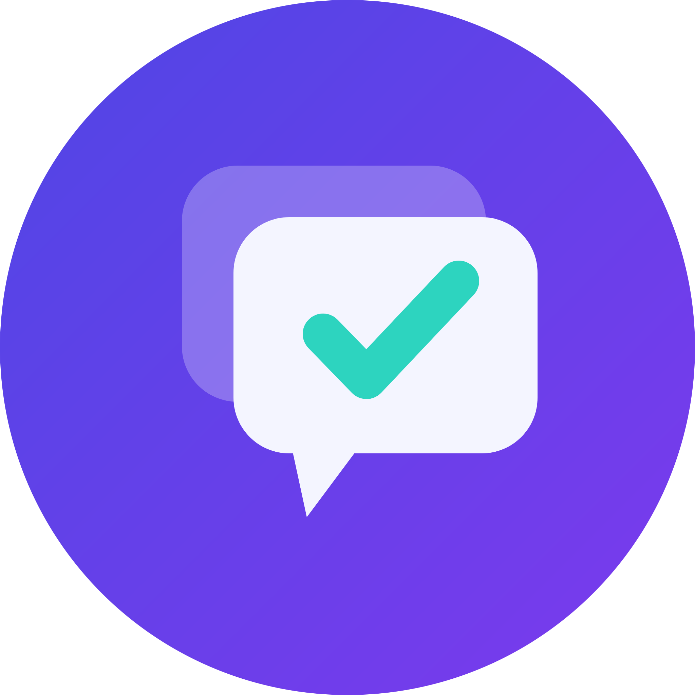

<!--
*** Built using the Best-README-Template.
-->
<!-- PROJECT LOGO -->
<br />
<p align="center">
<a></a>
  <h3 align="center">Dejavue</h3>
  <p align="center">
    Stop answering the same question twice — duplicate detection and a searchable knowledge base for Discord<br />
    <p align="center">
  <a href="https://github.com/lkaesberg/Dejavue/actions/workflows/ci.yml"></a>
  <a href="https://github.com/lkaesberg/Dejavue/blob/main/LICENSE"></a>
  <a href="https://github.com/lkaesberg/Dejavue/network/members"></a>
  <a href="https://github.com/lkaesberg/Dejavue/stargazers"></a>
</p>
    <p>
    <a href="https://github.com/lkaesberg/Dejavue/issues">Report Bug</a>
    ·
    <a href="https://github.com/lkaesberg/Dejavue/issues">Request Feature</a>
    </p>
    <a href="https://dejavue.app/">🌐 Website</a>
  </p>
</p>

---

<!-- TABLE OF CONTENTS -->
<details open="open">
  <summary><h2 style="display: inline-block">📋 Table of Contents</h2></summary>
  <ol>
    <li><a href="#-about">About</a></li>
    <li><a href="#-features">Features</a></li>
    <li><a href="#-usage">Usage</a></li>
    <li><a href="#-commands">Commands</a></li>
    <li><a href="#-tiers">Tiers</a></li>
    <li><a href="#-built-with">Built With</a></li>
    <li>
      <a href="#-self-hosting">Self Hosting</a>
      <ul>
        <li><a href="#docker-recommended">Docker (Recommended)</a></li>
        <li><a href="#manual-installation">Manual Installation</a></li>
        <li><a href="#discord-application-setup">Discord Application Setup</a></li>
        <li><a href="#configuration-options">Configuration Options</a></li>
      </ul>
    </li>
    <li><a href="#-architecture">Architecture</a></li>
    <li><a href="#-mcp-server">MCP Server</a></li>
    <li><a href="#-privacy">Privacy</a></li>
    <li><a href="#-contributing">Contributing</a></li>
    <li><a href="#-license">License</a></li>
  </ol>
</details>

---

## 📖 About

**Dejavue** is a Discord bot for help and Q&A channels. It catches duplicate questions the moment
they're posted, drives a clean *mark-solved* workflow, and turns every solved thread into a
searchable archive — inside Discord, on a public SEO-friendly website, and (on the top tier) as an
**MCP server** your AI tools can query.

It's useful for any server where the same questions keep coming back:

- **Developer tools & SaaS communities** — the same setup error, asked weekly
- **Game studios** — crash reports and "how do I…" threads
- **Open-source projects** — questions your docs don't answer yet

### How it works

1. **Someone posts** in a monitored channel → Dejavue reads the question and checks for duplicates
   (keyword on Free, semantic on Plus+). If it finds similar solved posts, it replies with the
   matches — plus, on Plus and up, an **AI-drafted answer**.
2. **Someone resolves it**: click **Mark as solved** (a modal captures the answer), right-click the
   helpful reply → **Apps → Mark as Answer**, or hit **Use this answer & close** to borrow a previous
   answer. Only the **original poster, a moderator, or an admin** can resolve a thread.
3. **Dejavue archives it**: swaps the `unsolved` → `solved` tag, stores the accepted answer plus the
   full transcript, embeds it for semantic search, writes an **AI summary** (Pro/Max), and — if the
   server opted in — publishes it to the public website.
4. **Everyone finds it again** with `/dejavue search`, on the website, or through the MCP server.

---

## ✨ Features

### 🔍 Duplicate detection & search

- Keyword (Free) or **semantic** (Plus+) duplicate detection on new posts, debounced with a
  starter-message retry so it never misses the question text
- `/dejavue search` over the solved-answer archive, with `broad` / `balanced` / `exact` match presets
  or a custom match threshold
- **Use this answer & close** borrows a matched answer, posts it, and marks the post solved as a
  duplicate — or **Not a duplicate** dismisses the suggestion

### ✅ Solving & archive

- Button + modal + message context menu + slash command, all permission-gated to OP/mod/admin
- Per-forum `solved` / `unsolved` tag automation (created automatically on setup)
- Full thread **transcript** captured on solve (speakers privacy-aliased on the public website)
- Two channel modes: **question** (Q&A — find duplicates, mark answers) and **knowledge**
  (archive everything, no prompts)

### 🤖 AI (credit-metered via OpenRouter)

- **Answer drafting** from past solved threads when a duplicate is found
- **Thread summarization** into a clean, canonical answer for the public website
- **Knowledge-gap clustering** — groups recurring questions so you know what docs to write
- **Auto-FAQ** generation and maintenance (respects manual edits)

### 🌐 Public website

- Per-server **subdomain** (`{slug}.dejavue.app`) or your own **custom domain**
- Each monitored **channel becomes its own category**; pages show the answer plus the full discussion
- `QAPage` / `FAQPage` JSON-LD, DB-driven sitemap, near-zero-JS pages for SEO
- **Opt-in per server** (default off); usernames aliased as "Original poster" / "Helper N"

### 🔌 MCP server (Pro & Max)

- Publishes your answers as a **Streamable HTTP MCP server** at `{slug}.dejavue.app/mcp`
- Add it to Claude, ChatGPT, Cursor, or any MCP client so your AI answers from your community's
  solved questions instead of guessing

### 📊 Ops

- Analytics: resolution rate, time-to-resolution, top helpers
- Stale-question **nudges** that ping a helper role on a timer
- **Re-scan** to import a channel's entire history into the archive, and to drop deleted posts

---

## 🚀 Usage

### Invite the Bot

[](https://dejavue.app/)

### Quick Setup

1. **Add the bot** to your server using the link above
2. **Monitor a channel**: `/dejavue setup channel:#help` — this also creates the `solved` /
   `unsolved` tags for forum channels
3. **Import your history**: `/dejavue rescan channel:#help` indexes past threads so duplicate
   detection works from day one
4. Done. Dejavue now replies to duplicates and archives every solved thread.

### Next steps

- `/dejavue customize` — set up your public website: branding, theme, custom domain and privacy
- `/dejavue settings` — turn nudges, channel-fit suggestions and the off-topic guard on or off
- `/dejavue insights` — see stats, analytics, recurring-question clusters and the auto-FAQ

> 💡 Run `/dejavue setup` with no channel to open the channel manager and review everything you've
> indexed.

---

## 📝 Commands

Everything lives under one `/dejavue` command, plus a **Mark as Answer** message context menu.

| Command | Description | Who |
|---------|-------------|-----|
| `/dejavue setup [channel] [mode]` | Add a channel, or run it alone to view & manage indexed channels | admin |
| `/dejavue rescan [channel]` | Re-scan a channel's full history and remove deleted posts | admin |
| `/dejavue settings` | Toggle nudges, channel-fit suggestions & the off-topic guard | admin |
| `/dejavue customize` | Customize your public website — branding, theme, domain & privacy | admin |
| `/dejavue insights` | Stats, analytics, recurring-question clusters & the auto-FAQ | anyone |
| `/dejavue search <query> [match] [threshold]` | Search your knowledge base | anyone |
| `/dejavue help` | Learn how Dejavue works | anyone |
| **Mark as Answer** (right-click a message → Apps) | Mark that reply as the accepted answer | OP/mod/admin |

### Options

| Option | Values | Description |
|--------|--------|-------------|
| `mode` | `question`, `knowledge` | Forums only. `question` runs the Q&A loop (duplicates + mark-answer); `knowledge` archives everything with no prompts. Default: `question` |
| `match` | `broad`, `balanced`, `exact` | How closely search results must match. Default: `balanced` |
| `threshold` | `0`–`100` | Custom minimum match percentage — overrides the `match` preset |

### Important: Bot Permissions

Dejavue needs **View Channels, Manage Channels, Send Messages, Embed Links, Read Message History,
Manage Threads** and **Send Messages in Threads**. Manage Channels is what lets it create and swap
the `solved` / `unsolved` forum tags — without it, tag automation fails.

The **Message Content** privileged intent must be enabled, since Dejavue reads question text to
detect duplicates.

---

## 📊 Telemetry

The hosted bot records **aggregate, per-server operational metrics** (threads indexed, AI
credits used, embedding tokens spent, subscription events) so the service can be run and
billed. The allowlist in `packages/analytics` makes it structurally impossible to emit
message content, thread titles, search queries, or Discord user ids. `distinct_id` is the
**guild** id.

Published knowledge bases additionally count **page traffic** in the visitor's browser
(`components/KbAnalytics.astro`), in PostHog's cookieless mode: no cookie, no local
storage, no persistent visitor id, no person profile, autocapture and session replay both
off. Visitors are counted by a hash PostHog computes server-side that rotates daily. The
apex marketing site is not instrumented at all. Because this runs client-side,
`POSTHOG_API_KEY` is rendered into the page — correct for a PostHog *project* key
(`phc_…`), which is public by design; never put a personal key (`phx_…`) there.

Free-plan knowledge bases also show **one ad** (`ADS_PROVIDER=ethicalads`). It is
cookieless and non-behavioural, and because loading it discloses the reader's IP to a
third party it is gated behind an explicit opt-in — nothing is requested until the visitor
agrees, and declining falls back to an in-house promo.

Both are disclosed in the privacy policy. Self-hosting sends nothing: leave
`POSTHOG_API_KEY` unset and no client is created, and leave `ADS_PROVIDER` at `none`.

---

## 💳 Tiers

The hosted bot is billed per server through **Discord Premium Apps**. AI usage is metered in **AI
credits** (1 credit = 1,000 model tokens, input + output): a drafted answer costs ≈ 0.8 credits and a
thread summary ≈ 3.

Only two things actually cost us money per server: **indexing** (embedding your messages) and
**AI generation**. So those are the only two things the tiers meter. Semantic search, analytics,
nudges and theming cost nothing to serve, so every server gets them.

| | **Free** | **Plus** €4.99 | **Pro** €9.99 | **Max** €24.99 |
|---|---|---|---|---|
| Forum channels | 3 | 15 | 50 | unlimited |
| Tracked (non-forum) channels | 3 | 15 | 50 | unlimited |
| **Indexed messages** | **2,500** | **25,000** | **250,000** | **unlimited** |
| Duplicate detection / search | semantic | semantic | semantic | semantic |
| Stale-question nudges | ✓ | ✓ | ✓ | ✓ |
| Analytics | full | full | full | full |
| Knowledge-base theming | ✓ | ✓ | ✓ | ✓ |
| AI-drafted answers | — | ✓ | ✓ | ✓ |
| AI summary / clustering / auto-FAQ | — | ✓ | ✓ | ✓ |
| **AI credits / mo** | — | **250** | **2,500** | **12,000** |
| Website page rendering | raw | AI-summarized | AI-summarized | AI-summarized |
| **MCP server** | — | — | **✓** (30 req/min) | **✓** (30 req/min) |
| Ads on the public site | shown | **none** | **none** | **none** |
| "Powered by Dejavue" branding | shown | removed | removed | removed |

**One-time purchases** (any tier): **Custom domain — €29.99** · **AI top-up** packs of 500 / 1,000 /
2,000 / 5,000 credits (consumable, stacks, never expires). Importing your existing history is free,
up to each tier's indexed-message limit.

> 💡 **Self-hosting has no tiers.** Set `DEV_FORCE_TIER=max` and every feature is unlocked — you
> just pay your own OpenRouter bill for the AI parts, or run embeddings on CPU for free.

---

## 🛠 Built With

- **[TypeScript](https://www.typescriptlang.org/)** — everything, in a pnpm workspace
- **[discord.js v14](https://discord.js.org/)** — gateway client, commands, interactions
- **[Postgres](https://www.postgresql.org/) + [pgvector](https://github.com/pgvector/pgvector)** —
  storage and vector search, via [Drizzle ORM](https://orm.drizzle.team/)
- **[Transformers.js](https://huggingface.co/docs/transformers.js)** — embeddings on CPU, free and
  local (`bge-small-en-v1.5`)
- **[OpenRouter](https://openrouter.ai/)** — LLM access for drafts, summaries and FAQs
- **[pg-boss](https://github.com/timgit/pg-boss)** — Postgres-backed job queue (no Redis)
- **[Astro](https://astro.build/)** — SSR for the public website and the MCP endpoint

---

## 🐳 Self Hosting

Dejavue is fully self-hostable — **no license key, no phone-home, no feature gating**. You have two
options: **Docker** (recommended) or **Manual Installation**.

**Requirements:** Docker, or Node.js 22+ with a Postgres 16 database that has the `pgvector`
extension available.

### Docker (Recommended)

The whole stack — Postgres, migrations, bot, worker and web — comes up with one command.

#### 1. Clone the repository

```bash
git clone https://github.com/lkaesberg/Dejavue.git
cd Dejavue
```

#### 2. Create the config file

```bash
cp .env.example .env
nano .env
```

Fill in at minimum:

```env
DISCORD_TOKEN=<Discord Bot Token>
DISCORD_CLIENT_ID=<Discord Bot Client ID>
OPENROUTER_API_KEY=<OpenRouter API Key>   # optional: only needed for AI features
DEV_FORCE_TIER=max                        # unlock every feature when self-hosting
```

#### 3. Start the stack

```bash
docker compose up -d --build
```

`DATABASE_URL` is auto-pointed at the bundled `postgres` service, migrations run on start, and the
CPU embedding model is cached in a named volume. The web app listens on port **4321**.

#### 4. Register the slash commands

```bash
docker compose exec bot pnpm --filter @dejavue/bot register
```

---

### Manual Installation

**Requirements:** Node.js v22 or higher

#### 1. Clone and install

```bash
git clone https://github.com/lkaesberg/Dejavue.git
cd Dejavue
corepack enable        # provides pnpm (version pinned in package.json)
pnpm install
```

#### 2. Create the config file

```bash
cp .env.example .env
nano .env
```

#### 3. Start Postgres and migrate

```bash
pnpm db:up             # Postgres (pinned pgvector/pgvector:pg16) in Docker
pnpm db:migrate        # extension + tables + HNSW index
pnpm db:verify         # proves pgvector cosine search works
```

Point `DATABASE_URL` at your own Postgres instead if you already run one — it needs the `pgvector`
extension.

#### 4. Run it

```bash
pnpm dev               # Postgres + migrations + bot + worker + web, with live reload
```

Or run the services individually: `pnpm dev:bot` / `pnpm dev:worker` / `pnpm dev:web`.

> 💡 `make setup` does steps 1–3 in one go, and `make help` lists every available task.

**Dev container:** open the repo in VS Code / Cursor and "Reopen in Container" — the
[.devcontainer](.devcontainer/devcontainer.json) starts Postgres alongside a Node 22 workspace,
installs dependencies, and runs migrations automatically (ports 4321/5432/8090 forwarded).

---

### Discord Application Setup

1. **Create an application** in the
   [Discord Developer Portal](https://discord.com/developers/applications)
2. **Bot → Privileged Gateway Intents:** enable **Message Content** only. Leave Presence and Server
   Members off.
3. **OAuth2 → URL Generator:** scopes `bot` + `applications.commands`; permissions: View Channels,
   Manage Channels, Send Messages, Embed Links, Read Message History, Manage Threads, Send Messages
   in Threads. Open the generated URL to add your bot.
4. **Register commands:** `pnpm --filter @dejavue/bot register` — uses `DISCORD_DEV_GUILD_ID` for
   instant guild-scoped commands, or registers globally if unset.
5. **Website domains** (optional): point `*.yourdomain.tld` (wildcard DNS + TLS) at the web app and
   set `KB_BASE_DOMAIN`. Custom domains CNAME to the same host.
6. **Monetization** (only if you're selling access): enable it in the portal, create the SKUs, and
   put their ids in `.env`. Self-hosters should just set `DEV_FORCE_TIER=max` instead.

---

### Configuration Options

| Option | Description |
|--------|-------------|
| `DATABASE_URL` | Postgres connection string (needs the `pgvector` extension) |
| `DISCORD_TOKEN` | Your Discord bot token |
| `DISCORD_CLIENT_ID` | Your Discord application's client ID |
| `DISCORD_DEV_GUILD_ID` | *(Optional)* Register commands to one guild for instant updates |
| `OPENROUTER_API_KEY` | *(Optional)* Enables AI drafts, summaries, clustering and the auto-FAQ |
| `OPENROUTER_MODEL` | Model for generative features (default `deepseek/deepseek-v4-pro`) |
| `KB_BASE_DOMAIN` | Base domain for public knowledge bases (default `dejavue.app`) |
| `KB_PUBLIC_URL` | Public URL of the marketing/website root |
| `KB_REVALIDATE_SECRET` | Signs the private-KB gate cookie. **Required in production** — the app refuses to boot without it rather than fall back to a constant published in this repo. `openssl rand -hex 32` |
| `TRUSTED_PROXY_HOPS` | How many reverse proxies sit in front, each appending to `X-Forwarded-For`. Decides which entry is trustworthy for rate-limit keys. `0` (default) ignores the header and uses the socket peer — correct for a directly exposed app. Traefik alone = `1`; Cloudflare + Traefik = `2`. Setting it **too high** is the dangerous direction |
| `EMBEDDING_PROVIDER` | `local` (default, free CPU) or `openrouter` |
| `EMBEDDING_MODEL` | Embedding model id — see the table below |
| `QUOTA_CREDITS_PLUS` / `_PRO` / `_MAX` | Monthly AI credits per tier (250 / 2,500 / 12,000) |
| `QUOTA_EMBED_TOKENS_FREE` / `_PLUS` / `_PRO` / `_MAX` | Monthly embedding-token ceiling per tier. A runaway guard, not the product limit (indexed messages is) — fail-closed on Free, alert-only on paid |
| `EMBED_MAX_CHUNKS_PER_THREAD` | Max chunks a single thread is split into. `0` (default) = unlimited, i.e. every message is embedded |
| `EMBED_BATCH_SIZE` | Chunks sent per embedding request (default 64) |
| `MCP_RATE_PER_MIN` | MCP endpoint rate limit (default 30) |
| `POSTHOG_API_KEY` | *(Optional)* Product analytics. Unset = nothing is sent at all — the expected setup when self-hosting |
| `POSTHOG_HOST` | PostHog host (default `https://eu.posthog.com`) |
| `ADS_PROVIDER` | `none` (default, and the right setting when self-hosting) or `ethicalads`. Free-tier knowledge bases only, behind a visitor opt-in |
| `ADS_PUBLISHER_ID` | Publisher id from the ad network. Without it `ethicalads` stays off — a provider with no id would render a permanently empty slot |
| `CHANNEL_JOB_CONCURRENCY` | Parallel channel history jobs (default 2). Keep at `1` on a memory-constrained host |
| `SKU_*` | Discord SKU ids — only needed if you monetize your own instance |
| `DEV_FORCE_TIER` | Force a tier (`free`/`plus`/`pro`/`max`). Set `max` when self-hosting |

#### Embeddings

Embeddings are pluggable via `EMBEDDING_PROVIDER`:

| Provider | `EMBEDDING_MODEL` | Cost | Notes |
|---|---|---|---|
| `local` (default) | `bge-small-en-v1.5` / `multilingual-e5-small` | free, on-CPU | downloads a small ONNX model |
| `openrouter` | `openai/text-embedding-3-large` | per-token API | reuses `OPENROUTER_API_KEY` |

Both produce **384-dim** vectors (`EMBEDDING_DIM`) so they share one `vector(384)` column — switching
is a config change. On startup the bot re-embeds threads with the new model, and search is scoped to
the active model id so stale vectors are never mixed in. Point `EMBEDDING_BASE_URL` /
`EMBEDDING_API_KEY` at `https://api.openai.com/v1` to call OpenAI directly instead of OpenRouter.

> 💡 **Fully offline AI:** with `EMBEDDING_PROVIDER=local` and no `OPENROUTER_API_KEY`, Dejavue runs
> duplicate detection, semantic search and the whole archive without sending anything to a third
> party. Only the generative features (drafts, summaries, FAQ) need an LLM.

---

## 🏗 Architecture

```
packages/core   shared types, env, tier/entitlement logic, clustering
packages/db     Drizzle schema + migrations (pgvector) + repositories
packages/ai     embeddings (Transformers.js) + OpenRouter LLM client
packages/queue  pg-boss queues + job definitions
apps/bot        discord.js gateway client (commands, events, interactions)
apps/worker     pg-boss jobs (embed, summarize, cluster, FAQ, nudge, backfill, reconcile)
apps/web        Astro SSR — public website (subdomain/custom-domain) + /mcp endpoint
```

The **bot** handles live query-embedding and interactions; the **worker** does the heavy and
scheduled work. They coordinate only through pg-boss and Postgres, so you can scale or restart either
independently. Tier is derived purely from Discord entitlements (hourly LIST reconcile + per-process
cache) and gates every feature in one place.

See [docs/PLAN.md](./docs/PLAN.md) for the full design rationale and milestone history.

---

## 🔌 MCP Server

Once a Max server has set a website slug and opted in, its published answers are queryable at
`https://{slug}.dejavue.app/mcp`. Add it to any AI client as a **Streamable HTTP** MCP server. It
exposes one tool:

```
search_knowledge_base(query: string, limit?: number)  → relevant solved Q&As with source links
```

---

## 🔒 Privacy

Dejavue is open source so you don't have to take our word for any of this — read the code, or host it
yourself.

- **Publishing is opt-in per server** and off by default. Nothing leaves Discord until an admin turns
  it on.
- **Public pages never show Discord identities.** Authors appear as neutral aliases ("Original
  poster", "Helper 1"); no usernames, display names, or avatars. Only the numeric user ID is stored
  internally.
- **No tracking cookies and no visitor profiling.** Knowledge-base traffic is measured in a
  cookieless mode (a daily-rotating, server-side hash — no cookie, no local storage, no persistent
  id). Fonts and scripts are self-hosted; the analytics SDK is bundled, not loaded from a CDN.
- **Free-tier knowledge bases show one ad** from a cookieless, non-behavioural network. Because the
  request discloses the reader's IP to that provider, it is **opt-in**: nothing loads until the
  reader agrees, and declining shows an in-house promo instead. Paid plans have no ads at all.
- **No user accounts** on the website or the knowledge bases.
- **Payments happen entirely inside Discord** — we never see payment details.
- **AI is the only third-party processor**, used only when AI features are enabled, and can be turned
  off entirely (see the offline note above).

Full details: [Privacy Policy](https://dejavue.app/privacy) · [Terms](https://dejavue.app/terms)

---

## 👥 Contributing

Contributions are welcome. See [CONTRIBUTING.md](./CONTRIBUTING.md) for the workflow, and
[SECURITY.md](./SECURITY.md) for reporting vulnerabilities.

Before pushing:

```bash
make check          # typecheck + tests
```

### Developer

- **Lars Kaesberg** — [GitHub](https://github.com/lkaesberg)

---

## 📄 License

Distributed under the **GNU Affero General Public License v3.0**. See [LICENSE](./LICENSE) for the
full text.

In short: you're free to use, modify and self-host Dejavue, including commercially. If you run a
modified version as a network service, you must make your source available to its users under the
same license.

---

<p align="center">
  Made with ❤️ by <a href="https://github.com/lkaesberg">Lars Kaesberg</a>
</p>
